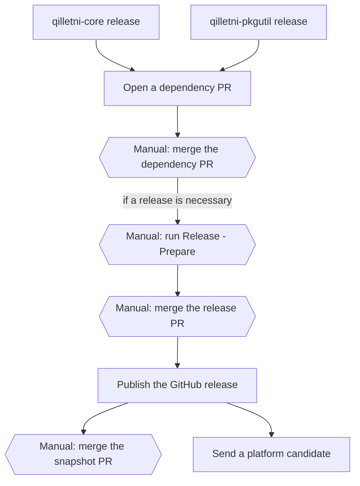

# QPMCLI Release Protocol

QPMCLI is a producer repository in the Qilletni release process. The shared procedure is
in the [Qilletni release document][main]. This document gives only the facts for this
repository.

## This repository

| Item | Value |
| --- | --- |
| Component | `qpm` |
| Kind | `cli` |
| Version | `qpmVersion` in `gradle.properties` |
| Publishes to | a GitHub release. This repository publishes nothing to Maven Central. |
| Release assets | `qpm-X.Y.Z.tar.gz`, `QPM.jar`, `component-manifest.json`, `bom.json` |
| Snapshots | the `snapshot` GitHub prerelease, replaced for each push to `master` |
| Jobs in `release.yml` | `tag-release`, `publish-snapshot`, `build-and-publish`, `dispatch-platform`, `snapshot-followup` |
| Lockfiles | `gradle.lockfile` |
| Pull request checks | `ci.yml` |

## Overview



- A hexagon with "Manual:" is a step that the maintainer does.
- A rectangle is a step that a workflow does.

## Prepare and publish a release

1. Write the changes in the `## [Unreleased]` section of `CHANGELOG.md`. For a major bump,
   also write `docs/migrations/X.Y.Z.md`. **(manual)**
2. Run the `Release - Prepare` workflow. Select the bump. **(manual)**
   Refer to [Prepare a release][prepare].
3. Examine the release PR, then merge it. **(manual)**
4. The `tag-release` job creates the tag. The `build-and-publish` job creates the GitHub
   release. Refer to [Publish a release][publish].

<details>
    <summary>What does this do?</summary>

The `build-and-publish` job in this repository is different from the job in Qilletni:

- It runs no japicmp gate. QPMCLI is a CLI distribution, not a library.
- The `releaseArchive` task makes `qpm-X.Y.Z.tar.gz`. The archive contains `QPM.jar`, the
  `qpm` launcher script, the SBOM and `component-manifest.json`.
- The job attaches the archive, the jar, the SBOM and the manifest to the GitHub release.

</details>

5. The `dispatch-platform` job sends a platform candidate to Qilletni. Merge the candidate
   PR in Qilletni. **(manual)** Refer to [Release the platform][platform].
6. The `snapshot-followup` job opens the snapshot PR. Merge it. **(manual)**

No repository consumes `qpm` as a dependency. A release of this repository opens no
dependency PR.

### Select the bump

This repository has no japicmp gate. The bump has one rule:

| Bump | The `Release - Prepare` workflow stops if |
| --- | --- |
| `patch` | — |
| `minor` | — |
| `major` | `docs/migrations/X.Y.Z.md` does not exist |

Use a major bump for an incompatible change to the CLI: a command, a flag, an exit code, the
configuration format or the registry protocol. Refer to `docs/migrations/README.md`.

## Consume upstream releases

This repository consumes two upstream components.

| Upstream component | Producer repository | Version key | Coordinates |
| --- | --- | --- | --- |
| `qilletni-core` | Qilletni | `qilletniCoreVersion` | `dev.qilletni.impl:qilletni` (`resolved: false`), `dev.qilletni.api:qilletni-api` |
| `qilletni-pkgutil` | QilletniPackageUtility | `qilletniPkgutilVersion` | `dev.qilletni.pkgutil:qilletni-pkgutil` |

QPMCLI builds against `qilletni-api` only, not against core. So `.qilletni/release.yml`
marks the core coordinate `resolved: false`. The `Dependency Update` workflow still
requires the core coordinate and examines its SHA-256. It does not expect core on the
classpath of this repository.

1. The `Dependency Update` workflow opens a dependency PR for each upstream release.
   Refer to [Update the consumer repositories][consumers].
2. Examine the dependency PR, then merge it. **(manual)**
3. Decide if this repository needs a release. If yes, do
   [Prepare and publish a release](#prepare-and-publish-a-release). **(manual)**

## Dependency locks

`gradle.lockfile` records the exact dependency graph of a release. After a dependency
change, refresh it:

```bash
./gradlew dependencies --write-locks -PincludeSiblingBuilds=false
```

The `Dependency Update` workflow refreshes the lockfile automatically.

## Local development

`-PincludeSiblingBuilds=true` builds against the sibling checkouts `../Qilletni` and
`../QilletniPackageUtility`. The flag is `false` by default. The release workflows and the
`ci.yml` workflow always build against the published Maven coordinates.

## Links

- [Qilletni release document][main]
- [`release/components.yml`](https://github.com/Qilletni/Qilletni/blob/master/release/components.yml)
- [`tools/release/README.md`](https://github.com/Qilletni/ReleaseTooling/blob/master/README.md)

[main]: https://github.com/Qilletni/Qilletni/blob/master/RELEASE.md
[prepare]: https://github.com/Qilletni/Qilletni/blob/master/RELEASE.md#prepare-a-release
[publish]: https://github.com/Qilletni/Qilletni/blob/master/RELEASE.md#publish-a-release
[consumers]: https://github.com/Qilletni/Qilletni/blob/master/RELEASE.md#update-the-consumer-repositories
[platform]: https://github.com/Qilletni/Qilletni/blob/master/RELEASE.md#release-the-platform
